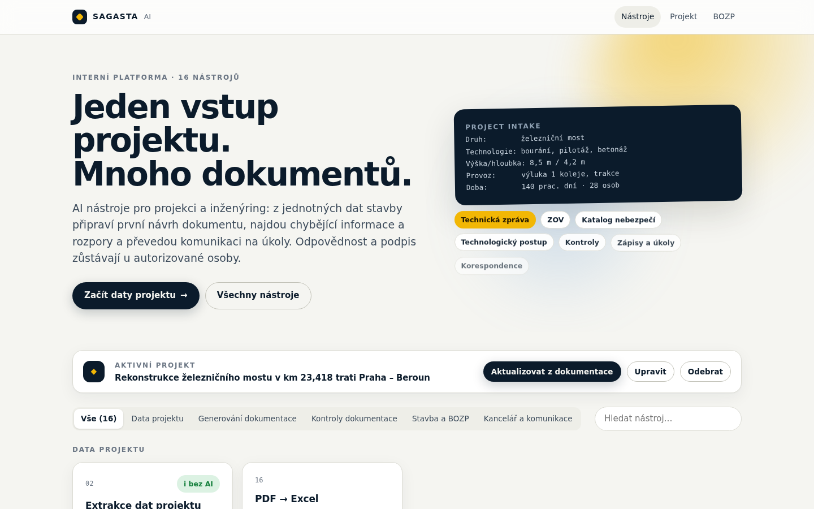
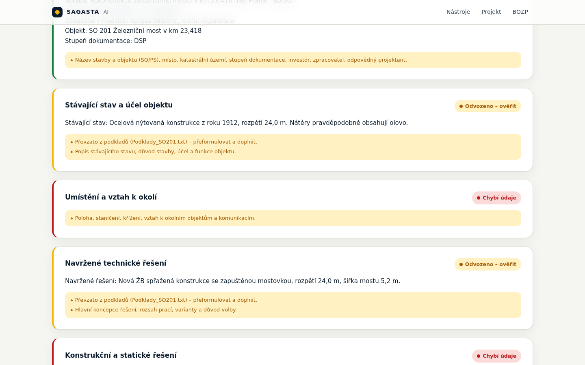
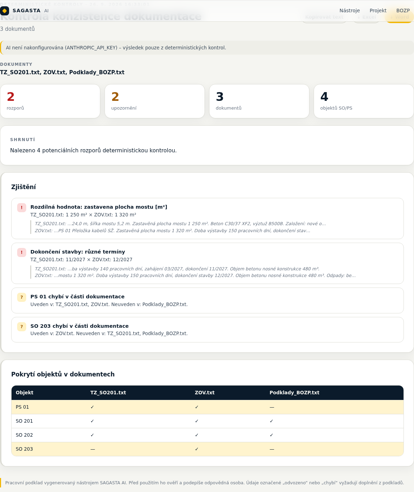

# SAGASTA AI platforma

16 AI tools for design and engineering work, built on **one shared project dataset**: **one input → many documents**.
The AI prepares drafts, finds missing information and inconsistencies, and turns communication into tasks. Deterministic checks run in code even without AI. Responsibility for regulated content stays with an authorised person.



## Tools

| # | Tool | Input → output | Without AI |
| --- | --- | --- | --- |
| 01 | **Katalog nebezpečí** | Construction → controlled hazard catalogue, P×Z, measures, obligations under Act 309/2006 Coll. | ✅ full rules engine |
| 02 | **Extrakce dat projektu** | PDF/DOCX documentation → project data (the active project for all tools) | ✅ labels, objects, quantities, dates |
| 03 | **Technická zpráva** | Project data + sources (+ a reference project) → technical report by section, with status found / inferred / missing | ◐ outline pre-filled from the sources |
| 04 | **Zásady organizace výstavby** | Project data → ZOV (transport, land take, waste, earthworks balance, traffic measures, BOZP, schedule) | ◐ outline pre-filled from the sources |
| 05 | **Technologický postup / postup bourání** | Activity → steps, checks, machinery, waste; safety linked to the hazard library | ◐ related hazards from the library |
| 06 | **Kontrola konzistence** | Several documents → conflicting areas, volumes, dates, SO/PS objects | ✅ |
| 07 | **Detektor chybějících informací** | Document → unfilled places, vague wording, questions for the designer | ✅ |
| 08 | **Kontrola požadované struktury** | Documentation → check against a controlled outline (building permit / technical report / ZOV) | ✅ by headings and keywords |
| 09 | **Porovnání revizí** | Version A + B → changed passages, objects, numbers; AI adds consequences | ✅ |
| 10 | **Registr připomínek** | Client comments (+ a revision) → register with actions, and a check of whether each was actually addressed | ◐ splits the comments |
| 11 | **Zápis z jednání a úkoly** | Transcript / notes → minutes, decisions, tasks with deadlines (Excel) | AI |
| 12 | **E-mail → úkol** | E-mail → tasks, priority, deadline, draft reply | AI |
| 13 | **Korespondence a RFI** | Rough notes → RFI / formal reply / response to an authority as a letter (DOCX) | AI |
| 14 | **Porovnání nabídek** | Bids A, B, C… → comparison table, exclusions, deviations; **does not pick a winner** | ✅ price, duration, warranty, exclusions |
| 15 | **Kontrola výkazu výměr** | BOQ (XLSX/CSV/PDF) + documentation → duplicates, zero quantities, bad products, units | ✅ |
| 16 | **PDF → Excel** | Tables in PDF → clean XLSX | ◐ tables from the PDF text layout |

Every tool has a **"Načíst ukázku"** (load sample) button with sample data for a fictional project (the reconstruction of a railway bridge), and exports to **Word** and, where it has tables, to **Excel**.




## Architecture

```
src/lib/project/intake.ts        shared Project Intake (zod) + store.ts (active project in the browser)
src/lib/tools/registry.ts        metadata for all tools: inputs, samples, categories
src/lib/tools/report.ts          one output model (Report) for all tools
src/lib/tools/analyzers/         deterministic checks: quantities, SO/PS, milestones, placeholders, BOQ, revisions
src/lib/tools/templates.ts       outlines for the technical report, ZOV, TP and demolition + structure rules
src/lib/tools/lenient.ts         tolerant repair of AI output before validation (see below)
src/lib/tools/server/            file extraction (PDF/DOCX/XLSX), Claude runner, handlers, DOCX/XLSX export
src/lib/hazards/                 hazard catalogue (controlled library, rules, AI merge)
src/app/nastroje/[slug]          generic tool page · src/app/api/tools/[slug] generic API
```

**Files:** PDFs go to Claude as documents (it sees drawings and tables) and also have their text extracted for the deterministic checks. DOCX goes through mammoth; XLSX and CSV through exceljs (formulas are read as results).

**AI:** the model is `claude-opus-5` (override with `ANTHROPIC_MODEL`). It uses streaming, adaptive thinking, structured output, server-side fallback on refusals, and a cached system prompt.

**Tolerant output:** the SDK converts `enum` values in the schema into description text only, so the API does not enforce them. Before validation, `lenient.ts` therefore:
- matches values that are close (case, diacritics);
- drops list items with an unknown ID (so the hazard catalogue can never contain a hazard outside the library);
- replaces other invalid values with a safe default.

A single bad value no longer throws away the whole response.

## Running

```bash
npm install
cp .env.example .env.local   # ANTHROPIC_API_KEY (optional – without it only deterministic checks run)
npm run dev                  # http://localhost:3000
npm test                     # 88 tests: analyzers, all tools with and without AI (stub), exports
npm run build
```

## Notes for production use

- The **outlines** (technical report, ZOV, building permit structure) and the **hazard library** are internal templates derived from Decree 131/2024 Coll. and the BOZP regulations. Before production use, the template owner has to confirm them against the current law.
- Without an API key, the tools marked "AI" return only a basic summary. The live Claude path is covered by tests with a stub client. It needs to be tried once against the real API with a key.
- Project data and drafts stay in the browser (localStorage). Documents are sent only to the server and to the Claude API.
