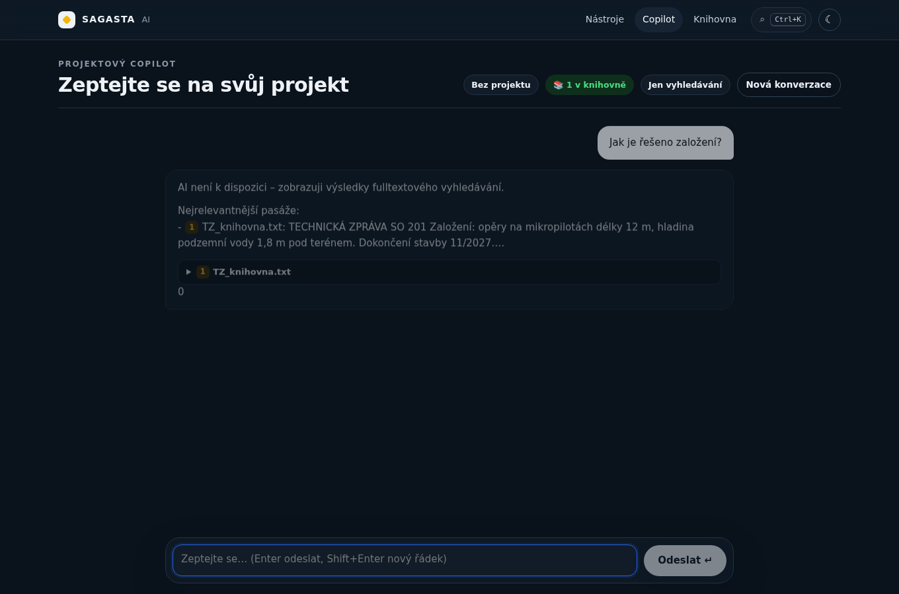
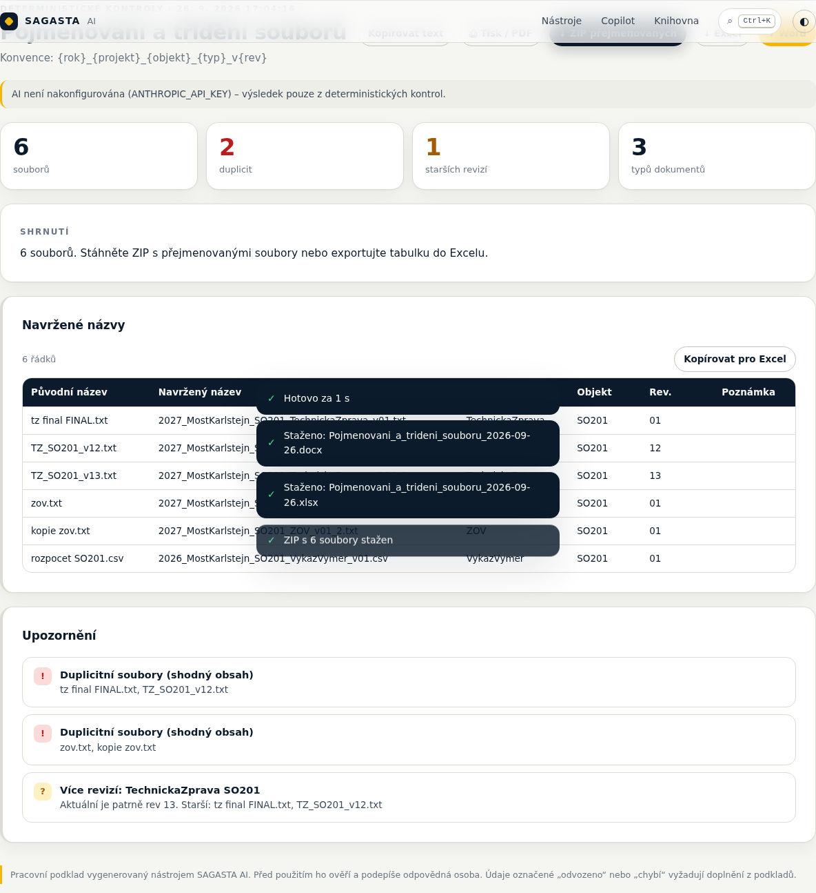

# SAGASTA AI platforma

**30 AI tools** for design, engineering and construction work, built on **one shared project dataset**: **one input → many documents**.
The AI prepares drafts, finds missing information and inconsistencies, and turns communication into tasks. Deterministic checks run in code even without AI. Responsibility for regulated content stays with an authorised person.


## The 30 tools

| # | Tool | Input → output | Without AI |
|---|---|---|---|
| **Project data** ||||
| 01 | Extrakce dat projektu | PDF/DOCX → project data (the active project for all tools) | ✅ |
| 02 | Dotčené orgány a podklady | Type of construction + conditions → authorities, site-operator and utility statements, permits | ✅ rule database |
| 03 | Vyhledávání v projektech | Query → passages from previous projects (BM25) + answer with citations | ✅ |
| 04 | Pojmenování a třídění souborů | Pile of files → naming convention, duplicates (SHA-256), revisions, **ZIP of renamed files** | ✅ |
| 05 | PDF → Excel | Tables in PDF → XLSX | ◐ PDF layout |
| 30 | **Projektový Copilot** | Question → answer from the active project and the local library, with sources and actions | ✅ search |
| **Generating documents** ||||
| 06 | Technická zpráva | Project data → technical report by section (found / inferred / missing) | ◐ outline from the sources |
| 07 | Zásady organizace výstavby | Project data → ZOV in all required areas | ◐ |
| 08 | Technická specifikace | Material + requirements → product-neutral specification | AI |
| 09 | Starý projekt → nový projekt | Document from an earlier project + new facts → adapted draft, % reusable | ✅ reusability analysis |
| **Documentation checks** ||||
| 10 | Kontrola konzistence | Documents → conflicting numbers, dates, SO/PS objects | ✅ |
| 11 | Detektor chybějících informací | Document → unfilled places, vague wording, questions | ✅ |
| 12 | Kontrola požadované struktury | Documentation → check against the outline (building permit / technical report / ZOV) | ✅ |
| 13 | Porovnání revizí | Version A + B → changes, objects, numbers, consequences | ✅ |
| 14 | Kontrola výkazu výměr | BOQ + documentation → duplicates, products, units | ✅ |
| **Construction and BOZP** ||||
| 15 | Katalog nebezpečí | Construction → controlled hazard catalogue P×Z, obligations under Act 309/2006 Coll. | ✅ |
| 16 | Technologický postup | Activity → steps, checks, safety linked to the hazard library | AI |
| 17 | Postup bourání | Structure → demolition sequence, stability, waste | AI |
| 18 | Zápis z kontrolního dne | Photos + voice note → site inspection report | AI (vision) |
| 19 | Fotografie → možné problémy | Photos → possible BOZP / quality / organisation issues | AI (vision) |
| 20 | Soupis vad a nedodělků | Photos + notes → defects and unfinished items by object | ✅ from notes |
| 21 | Předávací dokumentace | Handover documents → completeness check for the type of construction | ✅ |
| **Office and communication** ||||
| 22 | Zápis z jednání | Transcript → minutes, decisions, tasks | AI |
| 23 | Úkoly z jednání | Transcript → tasks by person (Excel) | ✅ commitments by wording |
| 24 | E-mail → úkol | E-mail → tasks, priority, deadline, draft reply | AI |
| 25 | Technický dotaz (RFI) | Problem → formal RFI | AI |
| 26 | Formální odpověď | Rough notes → formal letter | AI |
| 27 | Odpověď úřadu | Authority request → point-by-point response | AI |
| 28 | Registr připomínek | Comments + revision → register and a check that each was addressed | ◐ |
| 29 | Porovnání nabídek | Bids → comparison table, exclusions, deviations (**does not pick a winner**) | ✅ |

Every tool has sample data (**Alt+S**), exports to **Word** / **Excel**, a history of results and autosave of drafts.




## Operation and keyboard shortcuts

| Shortcut | Action |
|---|---|
| **⌘/Ctrl + K** | Command palette – every tool and action |
| **?** | List of all shortcuts |
| **⌘/Ctrl + Enter** | Run the tool |
| **Esc** | Cancel processing |
| **Alt + S** / **Alt + ⌫** | Load sample / clear form |
| **Alt + F** / **Alt + A** | Favourite tool / AI on-off |
| **⌘/Ctrl + ⇧ + E / X / C / P / Z** | Word / Excel / copy text / print or PDF / ZIP of renamed files |
| **g h · g p · g c · g k · g b** | Tools · project · Copilot · library · BOZP |
| **/** | Search (tools, library, Copilot) |
| **⌘/Ctrl + ⇧ + L** | Theme: system / light / dark |

Also:
- drag files anywhere on the page (they are routed to the right field automatically), or paste photos from the clipboard;
- photos are downscaled in the browser to 1600 px before upload;
- a **"Z knihovny"** button adds documents from the local library to any tool;
- the hub has favourite and recently used tools, and arrow-key navigation between cards;
- results have a table of contents, a severity filter, "copy table for Excel" (TSV) and print styles.

## Security

- **Access:** optional password for the whole app (`SAGASTA_PASSWORD`, HTTP Basic, constant-time comparison). SSO at the proxy level is recommended for production.
- **Headers:** CSP (`default-src 'self'`, `frame-ancestors 'none'`, `object-src 'none'`), HSTS, `nosniff`, `X-Frame-Options: DENY`, Referrer-Policy, Permissions-Policy; `no-store` on the API.
- **API:**
  - same-origin check (CSRF);
  - rate limiting per IP (`SAGASTA_RATE_LIMIT` = multiplier);
  - body size limits;
  - zod validation of every input, including exported reports (size limits).
- **Files:**
  - the actual type is checked by magic bytes, and the extension must match the content (a fake `.pdf` is skipped);
  - at most 4 files are processed in parallel;
  - SHA-256 hashes are used for duplicates.
- **AI:**
  - document contents are marked as data, not instructions (a prompt-injection guard);
  - document names are escaped;
  - values outside the controlled lists are dropped, not trusted.
- **Excel/CSV:** cells starting with `= + - @` are neutralised (formula injection).
- **Data:** the active project, library, history and drafts are stored **only in the user's browser** (localStorage / IndexedDB). The server stores nothing; documents go only to the Claude API.

## Architecture

```
src/lib/project/            shared Project Intake + active project (store.ts)
src/lib/tools/registry.ts   metadata for all 30 tools (inputs, samples, order)
src/lib/tools/report.ts     one output model + ReportSchema for export
src/lib/tools/analyzers/    deterministic checks (quantities, SO/PS, milestones, BOQ, revisions…)
src/lib/tools/rules.ts      handover, authorities, specification, document types
src/lib/tools/search.ts     BM25 full-text (server and browser)
src/lib/tools/lenient.ts    tolerant repair of AI output
src/lib/tools/server/       files (PDF/DOCX/XLSX/images), Claude, handlers, export
src/lib/security/guard.ts   rate limit, same-origin, size limits
src/middleware.ts           optional password
src/components/ux/          palette, shortcuts, toasts
src/lib/{library,history,idb,prefs}.ts   local data in the browser
```

**AI:** the model is `claude-opus-5` (`ANTHROPIC_MODEL`). It uses streaming, adaptive thinking, structured output with tolerant repair, server-side fallback on refusals, a cached system prompt, and vision for photos.

## Running

```bash
npm install
cp .env.example .env.local   # ANTHROPIC_API_KEY, optionally SAGASTA_PASSWORD
npm run dev                  # http://localhost:3000
npm test                     # 174 tests
npm run build && npm start
```

## Test coverage

- **Unit tests (174):**
  - every tool with AI off and with a stub AI returning deliberately messy data;
  - Word and Excel export of every report;
  - export schema validation;
  - analyzers, BM25, lenient repair;
  - security (rate limit, CSRF, size, formulas, fake file types, escaping, password middleware).
- **Browser (Playwright, production build):** all 30 tools from the hub, run with shortcuts, every export downloaded, no console errors, no horizontal overflow on mobile, plus 25 UX scenarios (palette, shortcuts, drafts, history, favourites, theme, library → Copilot, clipboard, drag and drop).
- **Not verified:** calls to the real Claude API. There is no key in the test environment; run each AI tool once with a real key before first use.

## Notes for production use

- The outlines (technical report, ZOV, structure check), the hazard library and the rules for authorities and handover are internal templates. Their owner has to confirm them against the current law. Authority competences in particular are phrased as "verify".
- The rate limit is kept in the process memory. For several instances, use a shared store (Redis).
