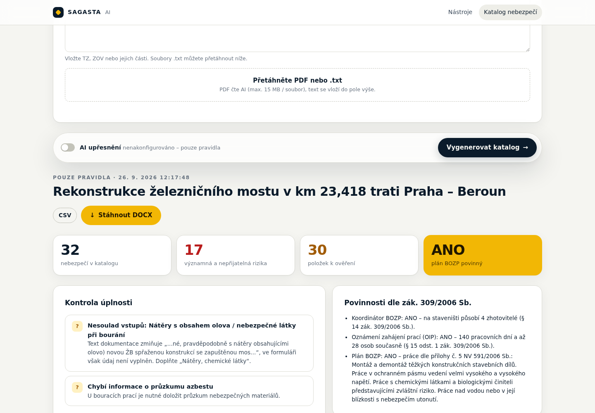
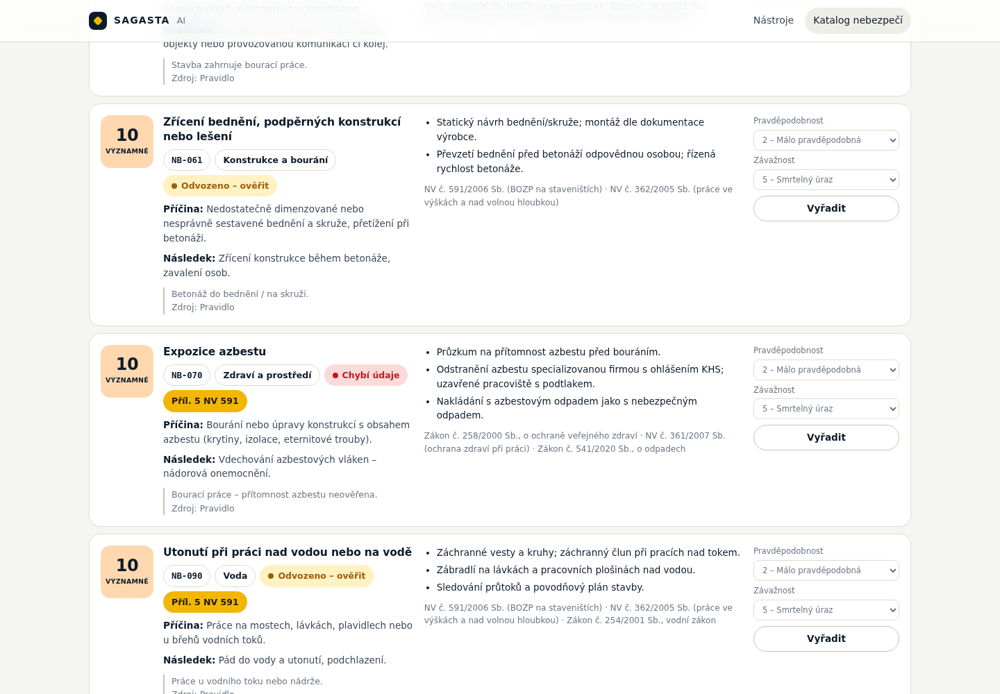

# SAGASTA AI platforma

Small AI "document machines" built on one shared project dataset. The idea is **one project intake that feeds many documents**: the technical report, B.10 ZOV, the hazard catalogue, the BOZP plan, and so on. The AI writes drafts, finds missing information and cross-checks documents. Responsibility for regulated content stays with an authorised person.

## Tool 01 – Katalog nebezpečí (hazard catalogue)

`Stavba → Katalog nebezpečí` at `/katalog-nebezpeci`

| Step | What happens |
| --- | --- |
| **Intake** | Construction type, activities, machinery, materials, height and depth, railway, road traffic, water, utilities, duration, headcount, plus free text and PDFs |
| **Rules** | A deterministic engine picks candidates from the **controlled hazard library** (`src/lib/hazards/library.ts`), each with a reason |
| **Claude** | Refines the selection, adds project-specific cause, consequence and measures, and cites evidence. `hazardId` is an **enum from the library**, so the model cannot invent a hazard name. New hazards may only be proposed under "Návrhy na doplnění knihovny" |
| **Safety net** | A rule candidate that the AI drops or omits **stays in the catalogue**, marked for review |
| **Checks** | Potentially missing categories: the documentation text vs. the catalogue and the form, e.g. "the text mentions a track closure but the form has no railway" |
| | Missing input data, plus questions for the designer |
| | Obligations under Act 309/2006 Coll.: BOZP coordinator, OIP notification, BOZP plan (Annex 5 of Government Regulation 591/2006 Coll.) |
| **Review** | Colour status 🟢 confirmed / 🟡 inferred / 🔴 data missing. P×Z can be edited and entries removed |
| **Export** | DOCX (landscape table with a signature block) and CSV for Excel |

Without `ANTHROPIC_API_KEY` the tool runs in **rules-only mode**. It still works, it just skips the AI refinement.




## Architecture

```
src/lib/project/intake.ts     shared Project Intake (zod) – future tools read the same data
src/lib/hazards/library.ts    controlled hazard library + regulations (curated by the library owner)
src/lib/hazards/engine.ts     rules, coverage check, missing data, obligations under 309/2006 Coll.
src/lib/hazards/ai.ts         Claude (structured output + enum IDs) and merge with the rules
src/lib/hazards/docx.ts       Word export
src/app/api/hazards/*         generate / export API
src/components/…              intake form, catalogue view
```

The model is `claude-opus-5` by default (overridable with `ANTHROPIC_MODEL`). It uses adaptive thinking, structured outputs and server-side fallback on refusals. The system prompt containing the library is cached.

## Running

```bash
npm install
cp .env.example .env.local   # optional: ANTHROPIC_API_KEY
npm run dev                  # http://localhost:3000
npm test                     # unit tests (rules, merge, obligations, DOCX)
npm run build
```

## Extending the library

Add an entry to `HAZARD_LIBRARY` with an `id` (`NB-xxx`), an approved name, measures, regulations and an `applies` rule. The model automatically gets the new entry in its enum. A change to the library should be reviewed by the BOZP coordinator, the same way internal document templates are.

> The regulation citations in the library are at the level of the regulation and topic. Before production use, the library owner has to confirm them against the current law.
